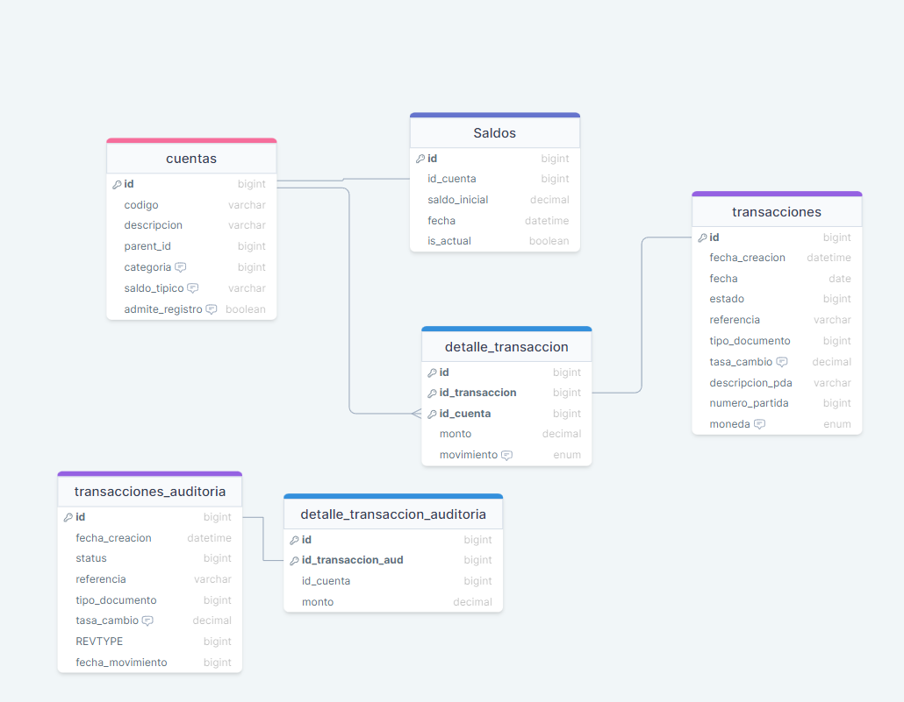

# Modulo Contabilidad STI MVP (minimum viable product)

Producto minimo viable de sistema de contabilidad

## Esquema de Base de Datos

### Tabla Cuentas

- id: identificador de la tabla
- codigo: codigo de la cuenta
- descripcion: descripcion de la cuenta
- Tipo_estado_financiero:?
- parent_id: Padre de la cuenta cuenta si lo tiene
- Moneda: moneda de la cuenta (L, USD, EUR, ETC)
- categoria:?
- tipo_cuenta:?
- Saldo_tipico:Naturaleza de la cuenta (Debe, Haber)
- adminte_registros:?
- Saldo_inicial: saldo con el que se registra la cuenta

### Tabla Transacciones

- id: identificador de la tabla
- fecha_creacion: fecha y hora del registro
- fecha: fecha en que se creo
- estado: estado de la transaccion (Borrador, aprobada, posteada etc)
- Referencia: Aqui puede ser el numero de factura, N/C, N/D etc
- tipo_documento: Factura, N/C, N/D etc
- tasa_cambio: tasa de cambio que se manejara en la transaccion

### Tabla detalle_transacciones

- id: identificador de la tabla
- id_transaccion: referencia al id de la tabla transacciones(FK)
- id_cuenta: referencia de al id de cuentas (FK)
- monto: monto de la transaccion

## Tablas con el sufijo \_auditoria

Esta tablas seran usadas como auditoria registran el movimiento que ocurra en las tablas a las que hacen referencia, esto sera manejado por el ORM
